# Integrantes:
- Velez Ian
- Rodriguez Gustavo
- Alcivar Cristhopher
- Flores Diego
- Joviric Isaac
- Palacios Anthoy
## Testing


### 1er Paso.
#### Nos movemos de promp y generamos la imagen.
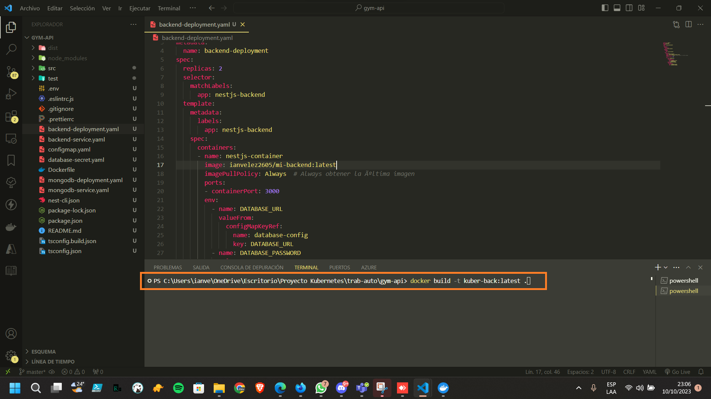

### 2do Paso.
#### Nos logeamos con docker para continuar con los pasos
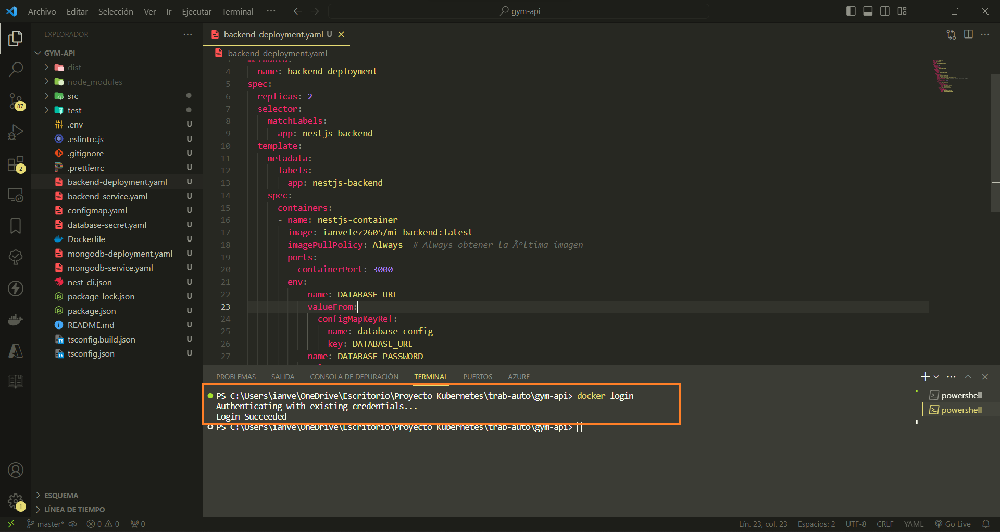

### 3er Paso.
#### Le hacemos el tag a la imagen
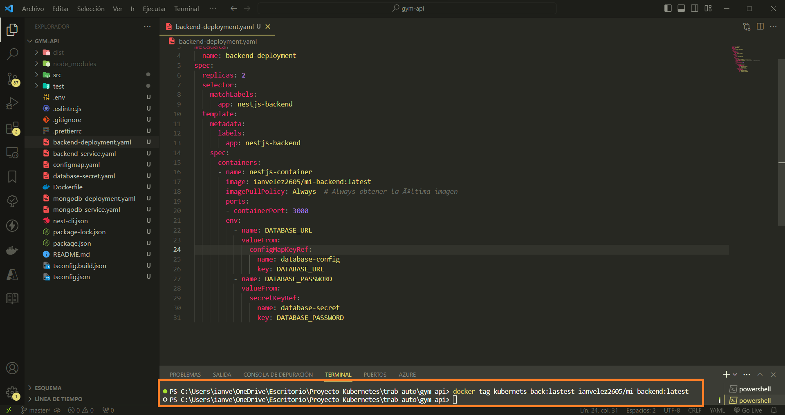

### 4to Paso
#### Luego comenzamos a aplicar los cambios en todos nuestros archivos .yaml
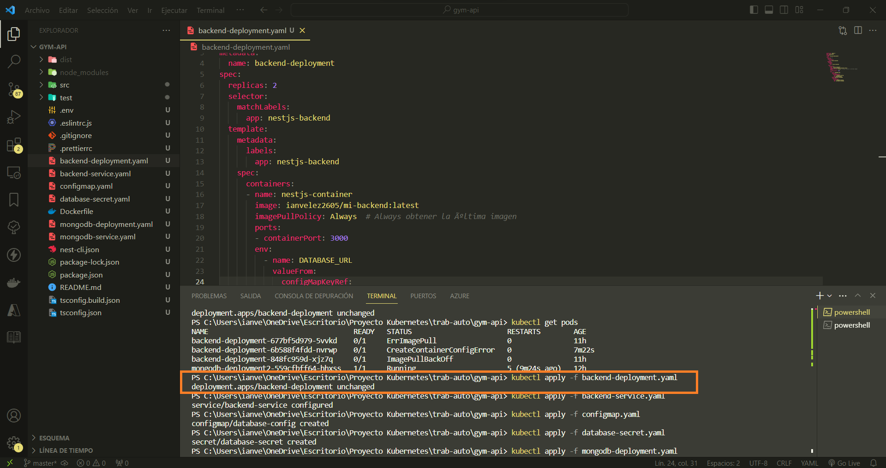

### 5to Paso (OPCIONAL)
#### Si llegan a presentar un error al momento de ejecutar, corren el siguiete código
```sh
  minikube docker-env | Invoke-Expression
```
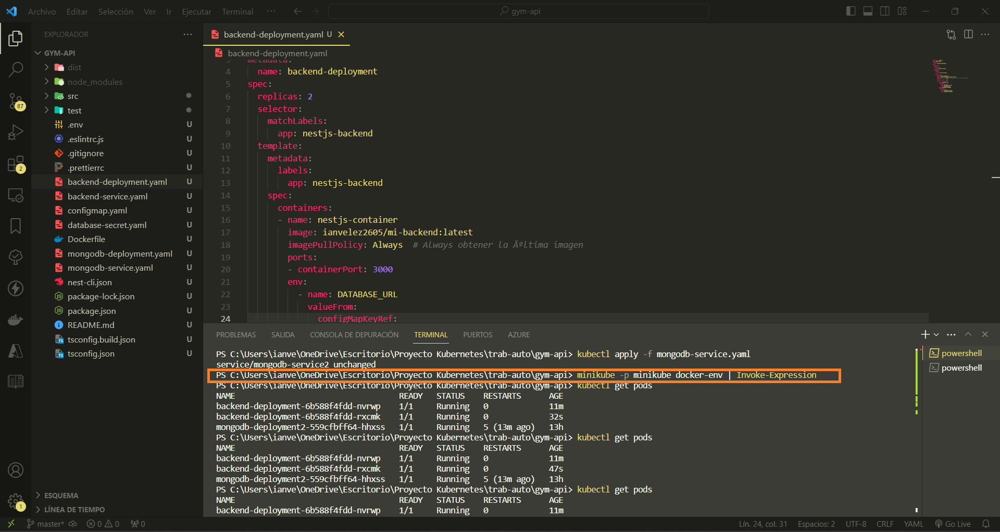

### 6to Paso
#### Corremos con el siguiente código verificando que todo funcione de manera correcta.
```sh
    minikube service backend-service  
```    
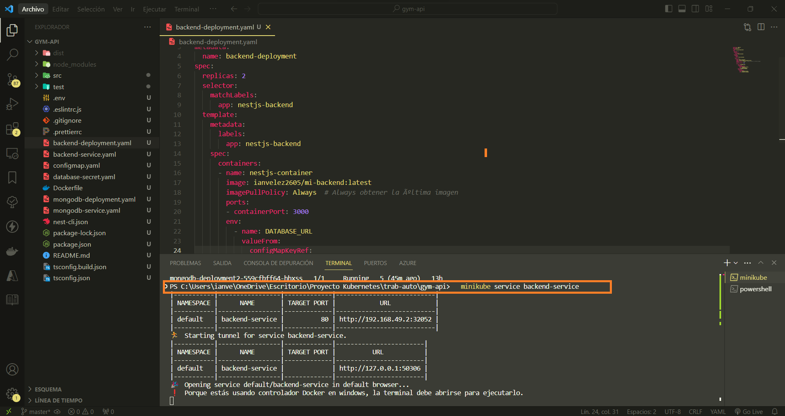

### 7mo Paso
#### Aquí una vez ejecutado nos dará la dirección en la que se alojó.

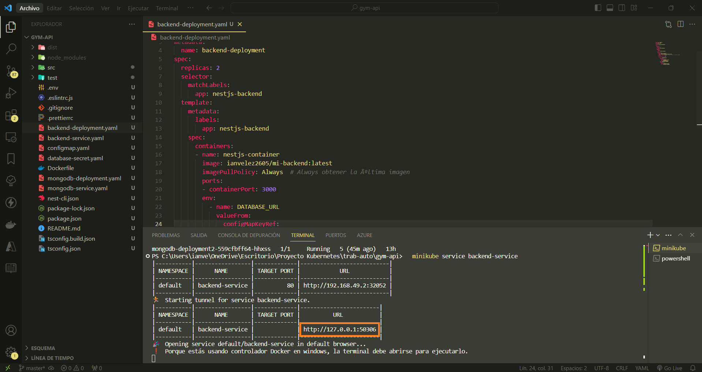

### 8vo Paso
#### Podemos verificarlo desde la web

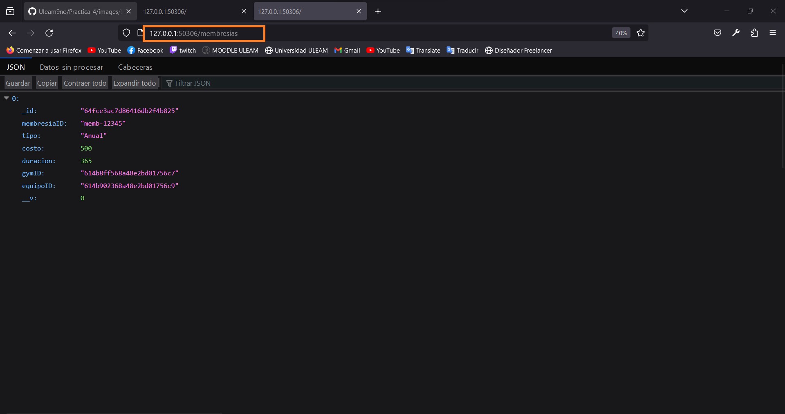

### 9no Paso
#### Podemos hacer post y gest con la herramienta Postaman para evaluar si funcionamiento.

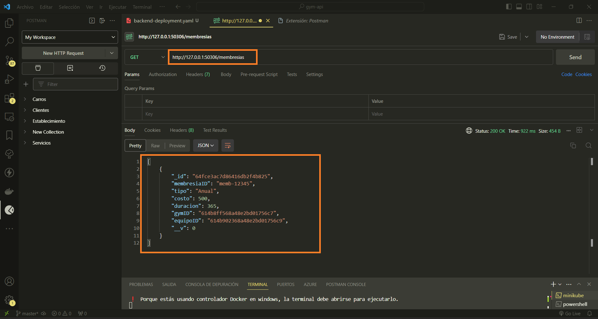

### 10mo Paso
#### Aquí podemos ver la image creada de docker.

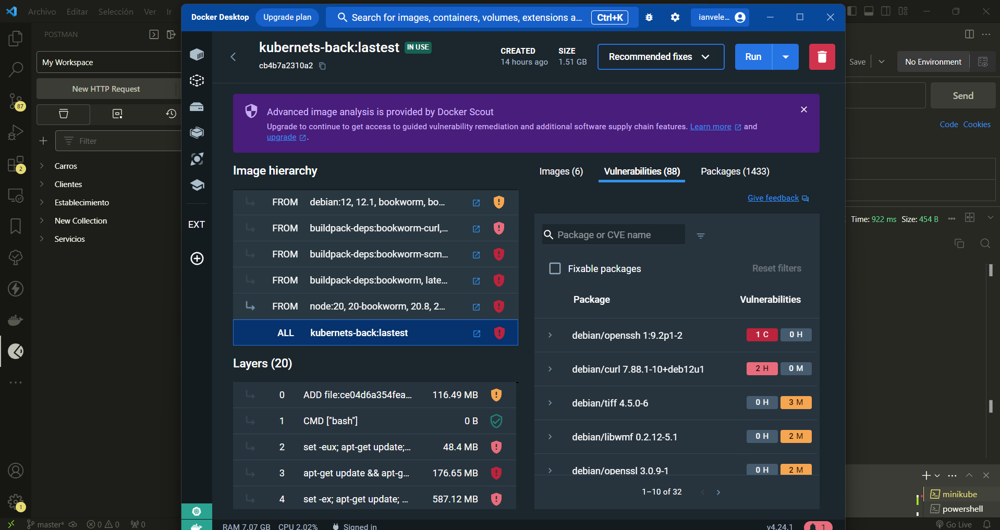

#### NOTA: modelo entidad relación

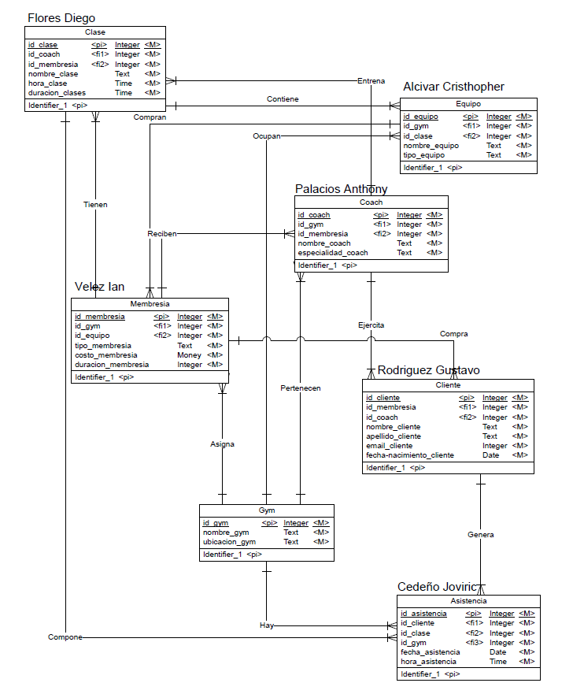